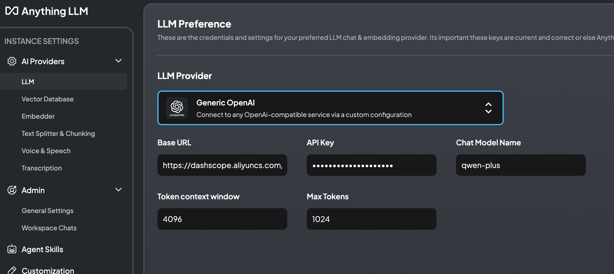

# monster-offer-hunter
This is a group project of polyu comp5423. The main goal of this project is helping students to find a job.

## spider part
the spider demo files are in spiders directory, you can enter it and use it to crawl data you want.

Relevant packages are listed in `requirements.txt`. To install them, run:

```bash
pip install -r requirements.txt

```

note: the boss part data will store in mysql, so you need to have a mysql in you laptop, or to comment them and store in a file you can hack.

if you need mysql, the table is here:

```mysql
drop database if exists spider_db;
create database if not exists spider_db;
       
use spider_db;

drop table if exists job_info;
create table spider_db.job_info
(
    category         varchar(255) null comment '一级分类',
    sub_category     varchar(255) null comment '二级分类',
    job_title        varchar(255) null comment '岗位名称',
    province         varchar(100) null comment '省份',
    job_location     varchar(255) null comment '工作位置',
    job_company      varchar(255) null comment '企业名称',
    job_industry     varchar(255) null comment '行业类型',
    job_finance      varchar(255) null comment '融资情况',
    job_scale        varchar(255) null comment '企业规模',
    job_welfare      varchar(255) null comment '企业福利',
    job_salary_range varchar(255) null comment '薪资范围',
    job_experience   varchar(255) null comment '工作年限',
    job_education    varchar(255) null comment '学历要求',
    job_skills       varchar(255) null comment '技能要求',
    create_time      varchar(50)  null comment '抓取时间'
);
```
## Data Extract

After crawling the data, it is necessary to extract the relevant parts from it. Then use LLM to extract data as needed by adding prompt words.The codes are in DataExtract directory.
Run `DataClean.py` and `LLM_extract.py` in turn. Please pay attention to the path of the input and output files.

## How to run AnythingLLM?

1、下载AnythingLLM Desktop，下载链接https://docs.anythingllm.com/installation-desktop/overview

2、创建阿里云账号，登录阿里云百炼平台，开通百炼的模型服务，生成API Key。参考文档：https://help.aliyun.com/zh/model-studio/getting-started/first-api-call-to-qwen?spm=a2c4g.11186623.help-menu-2400256.d_0_1_0.50d72bdbbd7q4v

4、打开AnythingLLM Desktop，选择Generic OpenAI。Base URL填https://dashscope.aliyuncs.com/compatible-mode/v1。



5、创建workspace，填入promot，上传训练用的数据集。
